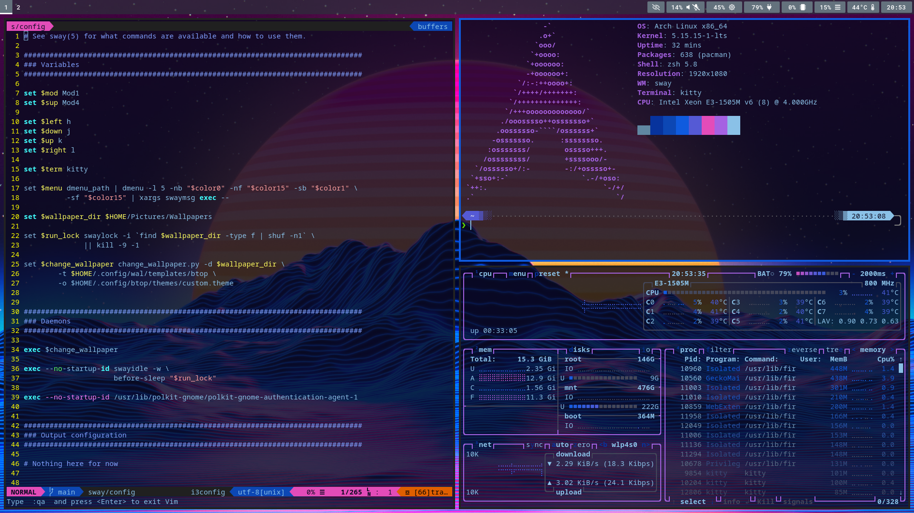
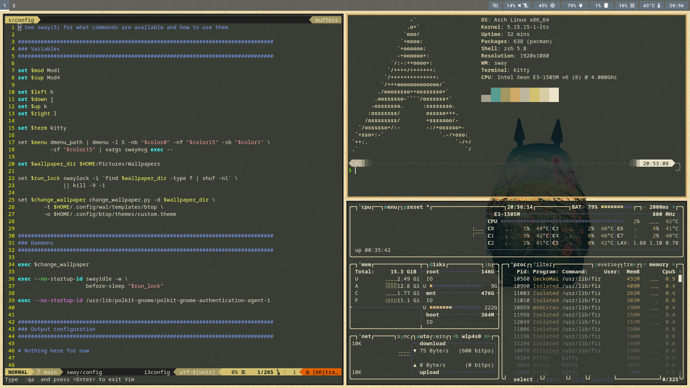

# Wayland/Sway Setups

Update theme color with [pywal](https://github.com/dylanaraps/pywal) for [sway](https://github.com/swaywm/sway), terminal, [kitty](https://github.com/kovidgoyal/kitty), [btop](https://github.com/aristocratos/btop) and [vim airline](https://github.com/vim-airline/vim-airline)




## Sway
 - Install `pacman -S sway kitty dmenu grim mako slurp swayidle swaylock wallutils waybar xorg-xwayland brightnessctl pavucontrol ttf-roboto-mono` 
 - Install Nouveau: `pacman -S mesa`
 - Install polkit: `pacman -S polkit-gnome`
 - Install pywal: `pacman -S python-pywal`

### Audio and Play
 - Install PulseAudio: `pacman -S pulseaudio pulseaudio-bluetooth pulseaudio-alsa`
 - Install playerctl: `pacman -S playerctl`

## zsh
 - Install `pacman -S powerline-fonts zsh-theme-powerlevel10k-git zsh-autosuggestions neofetch`
 - Link `zsh/p10k.zsh` to `$HOME/.p10k.zsh`
 - Link `zsh/zshrc_common` to `$HOME/.zshrc_common`
 - Link `zsh/zshrc` to `$HOME/.zshrc`

## Firewalld
 - Install `pacman -S firewalld`
 - Enable and start `firewalld.service`

## USBGuard
 - Install `pacman -S usbguard`
 - Enable and start `usbguard.service`
 - Generate basic rule allowing all the currently connected devices: `usbguard generate-policy >> /etc/usbguard/rules.conf`
 - Restart USBGuard: `systemctl restart usbguard`

## Ranger File Manager
 - Install `pacman -S ranger poppler python-pillow`
 - Link `ranger` to `$HOME/.config/ranger`

## Git
 - Link `git/gitconfig` to `$HOME/.gitconfig-extra`
 - Add the following to the `.gitconfig` file:
   ```
   [include]
       path = .gitconfig-extra
   ```

## btop
 - Install: `pacman -S btop`
 - **Copy** over the `btop` dir to `.config/btop`
 - Call `change_wallpaper.py` once to generate custom theme.
 - Change theme to custom theme.

## Vim
 - Install: `pacman -S vim-airline powerline-fonts vim-fugitive`
 - Link `vim/vimrc` to `$HOME/.vimrc`
 - Link `vim/wal.vim` to `$HOME/.vim/autoload/airline/themes/wal.vim`

## Misc
 - Link `local/bin/change_wallpaper.py` to `.local/bin/`, and give execute permission
 - Put some wallpapers under `$HOME/Pictures/Wallpapers`
 - Install TrackPointd for Thinkpads: https://github.com/zli117/TrackPointd
 - Install kmon: `pacman -S kmon`
